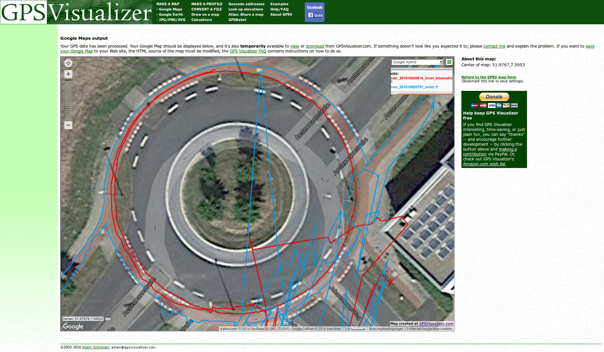
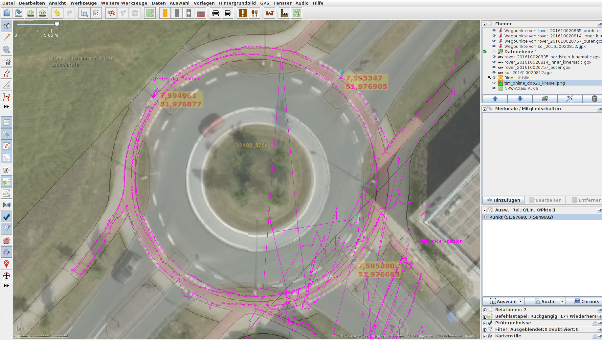

#Estimating GEO-reference accuracy of satellite imagery

##Problem
Newer imaging satellites like the WorldView-4 claim a Geolocation Accuracy of ["<4 m CE90"](https://dg-cms-uploads-production.s3.amazonaws.com/uploads/document/file/196/DG_WorldView4_DS_11-15_Web.pdf) without ground control, but what accuracy do they reach in practice? (More [details](https://calval.cr.usgs.gov/JACIE_files/JACIE11/Presentations/WedPM/115_Bresnahan_JACIE_11.005.pdf) on CE90).

These are some notes of exploring the accuracy of current commercial offerings on a [roundabout](http://www.openstreetmap.org/?mlat=51.97677&mlon=7.59517#map=19/51.97677/7.59517) that is quite well visible from space because of the high-contrast cycleways (red).

##Procedure
We understand the red cycleway as a "ring" around the roundabout and take DGPS traces on the marking if the inner and outer ring that is formed by the cycleway, whereas the inner line is the one closest to the roundabout. 

###Data collection
Data is collected with a u-blox NEO M8N (FWVER=SPG 3.01,PROTVER=18.00) in an evaluation kit which comes with its own antenna. The software for data collection is [RTKLIB](http://rtklib.com/) 2.4.3. b26. The u-blox is commanded to send UBX messages with the u-center software 8.21 (Message View->ubx->enable child messages). The configuration file for RTKLIB is to be found in the folder.

Data collection takes place on the inner ring, outer ring, on a cabinet just before the orderbase building, the north-west corner of the bus stop roof and the intersection of outer ring of the cycleway and street on the ground.

Live DGPS correction data is retrieved from the [SAPOS HEPS System](http://www.sapos.de/dienste-im-ueberblick.html) ("base"-logs) with a LTE stick via NTRIP.

###Post-Processing
The live-captured data showed some flurks, especially near the buildings. Post-Processing was done converting the .ubx files to RINEX observations with rtkconv, then creating the solutions in "kinematic" mode with rtkpost.

After converting the .pos files to .gpx with pos2kml and the -gpx option, a first view shows clearly the two paths that were walked along.

##Plotting on Satelite Imagery
Uploading the GPX tracks to a service that overlays it with Google Maps yields quite impressive results. However, it is clearly visible that Google's Street Data is ~4m wrong at the roundabout.

Overlaying the GPX track with the NRW ALKIS WMS Service in [JOSM](https://josm.openstreetmap.de/) makes its good quality apparent. Additionally, BING images also has some neat alignment (without manual alignment in JOSM).

Furthermore a DOP 20 Picture was hand-aligned as background. Differences between coordinates extracted in [TIM-Viewer](http://www.tim-online.nrw.de/tim-online/initParams.do) (Yellow boxes, red numbers) to the ones then measure in JOSM average 2.5\*10^-6 for lat, 4.9\*10^-6 for long Degrees decimal, which [should be](https://wiki.openstreetmap.org/wiki/DE:Genauigkeit_von_Koordinaten) sub-decimeter range.

#Conclusion
This sample of Orthophoto and Satellite Images' Geo-References are accurate to within some centimeters, at mos decimeters. That is roughly as accurate as one can get with a ~150€ GPS receiver with commercial correction data.
